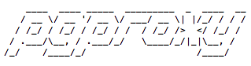

# pgproxy
[](https://travis-ci.org/wgliang/pgproxy)
[](https://codecov.io/gh/wgliang/pgproxy)
[](https://godoc.org/github.com/wgliang/pgproxy)
[](https://landscape.io/github/wgliang/pgproxy/master)
[](https://www.quantifiedcode.com/app/project/98b2cb0efd774c5fa8f9299c4f96a8c5)
[](https://goreportcard.com/report/github.com/wgliang/pgproxy)
[](http://www.apache.org/licenses/LICENSE-2.0.html)

pgproxy is a postgresql proxy server, through a pipe redirect connection,then you can filter the requested sql statement. The future it will support multi-database backup, adapt to distributed databases and other scenes except analysis sql statement.

You can do:

* database read and write separation
* database services disaster recovery
* proxy database
* rewrite sql statement
* filter dangerous sql
* monitor database operations
* sql requests current limit and merge

## Installation

```
$ go get -u github.com/wgliang/pgproxy
```

## Using

### As a separate application

Start or shut down the proxy server.
```
$ pgproxy start/stop
```

Use pgproxy on the command line
```
$ pgproxy cli
```

Ps: You can use it as you would with a native command line.

### Be called as a package

[package_example](https://github.com/wgliang/pgproxy/blob/master/examples/package_example.go)

```
package main

import (
	"fmt"
	"os"
	"os/signal"
	"syscall"

	"github.com/wgliang/pgproxy/cli"
)

func main() {
	// call proxy
	cli.Main("../pgproxy.conf", []string{"pgproxy", "start"})
	
	// 捕获ctrl-c,平滑退出
	chExit := make(chan os.Signal, 1)
	signal.Notify(chExit, syscall.SIGINT, syscall.SIGTERM, syscall.SIGKILL)
	select {
	case <-chExit:
		fmt.Println("Example EXITING...Bye.")
	}
}

```

## Support

select/delete/update statement and support any case.

On the support of the sql standard：

parser is froked from vitess's [sqlparser](https://github.com/youtube/vitess/tree/master/go/vt/sqlparser) of youtube.

In pgproxy, database tables are like MySQL(5.6,5.7) relational tables, and you can use relational modeling schemes (normalization) to structure your schema. It supports almost all MySQL(5.6,5.7) scalar data types. It also provides full SQL support within a shard, including JOIN statements. Some postgresql operations are not supported,detail see [support type and keywords](https://github.com/wgliang/pgproxy/blob/master/parser/token.go#L37).


## Credits

package parser is base on [sqlparser](https://github.com/xwb1989/sqlparser)